# SMS-Spring-Boot
Student Management System Using Spring Boot

## Features
- Spring Boot Backend and Frontend Postman
- CRUD Features
- Spring Boot Entire Model
- HTTP Status and Methods
- Exception Handling Using Global Exception and Custom Exception
- Stream API and Lambda Expression
- Solid Principles
- Easy to Understand Code
 

## Installation
- Just, Clone this repository - 
````bash 
git clone https://github.com/SLoharkar/SMS-Spring-Boot.git
````
- Run File Using Any Java Application Like Eclipse IDE For Java Developer or Visual Studio Code


## Website Trailer

https://github.com/SLoharkar/SMS-Spring-Boot/assets/68845746/63f00a03-8d3b-4a51-a2e2-68950d6b785d


## Website Highlights
<p align="left" width="100%">

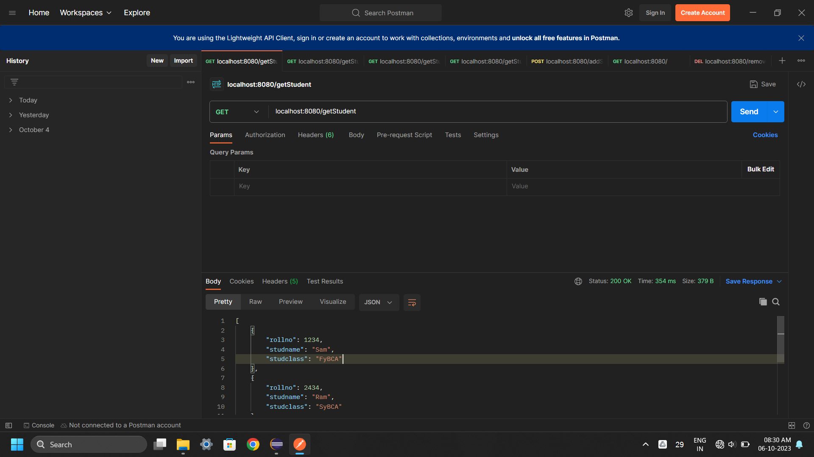
  
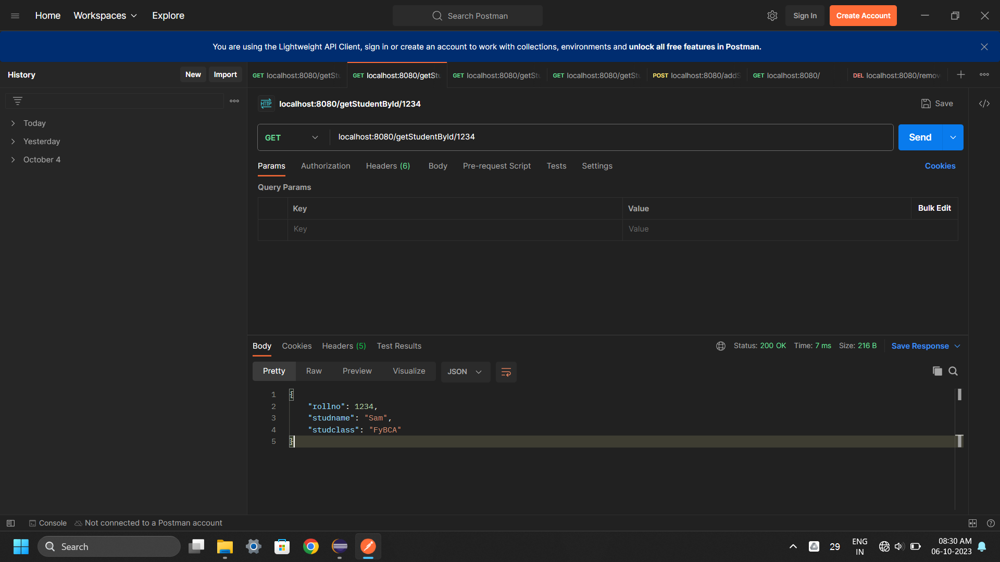


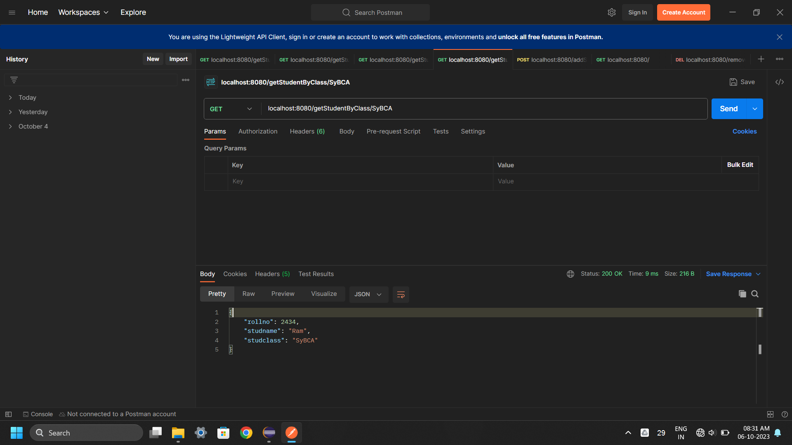

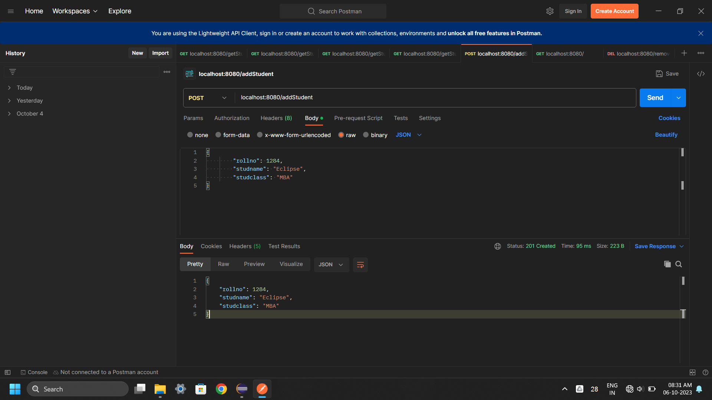

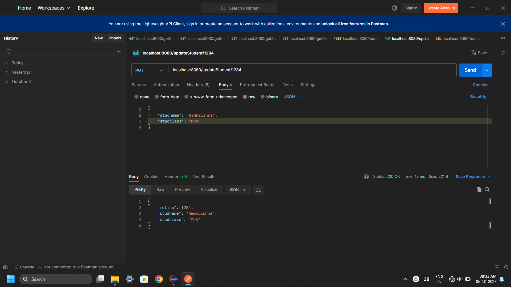

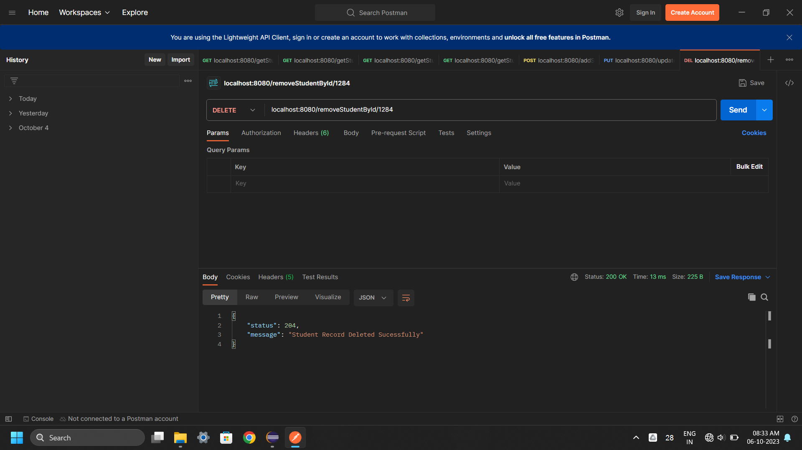

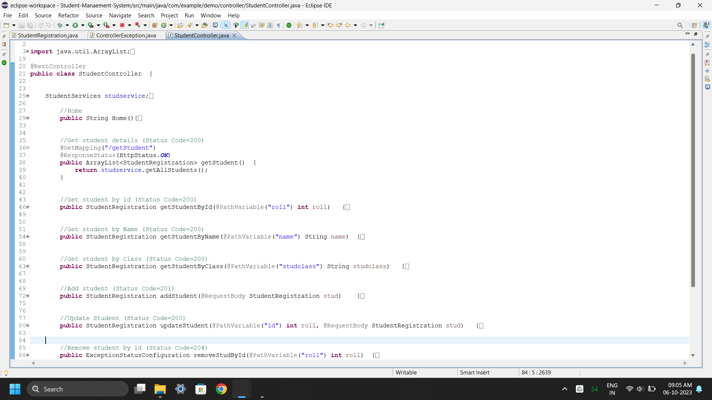

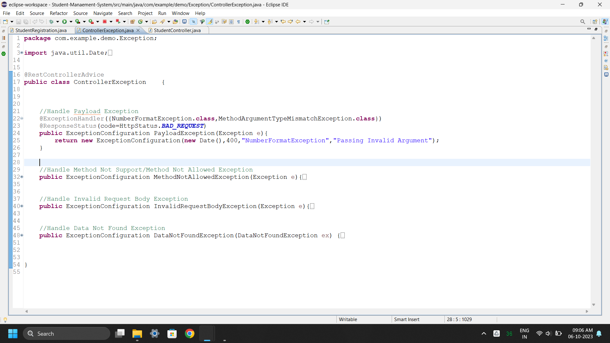

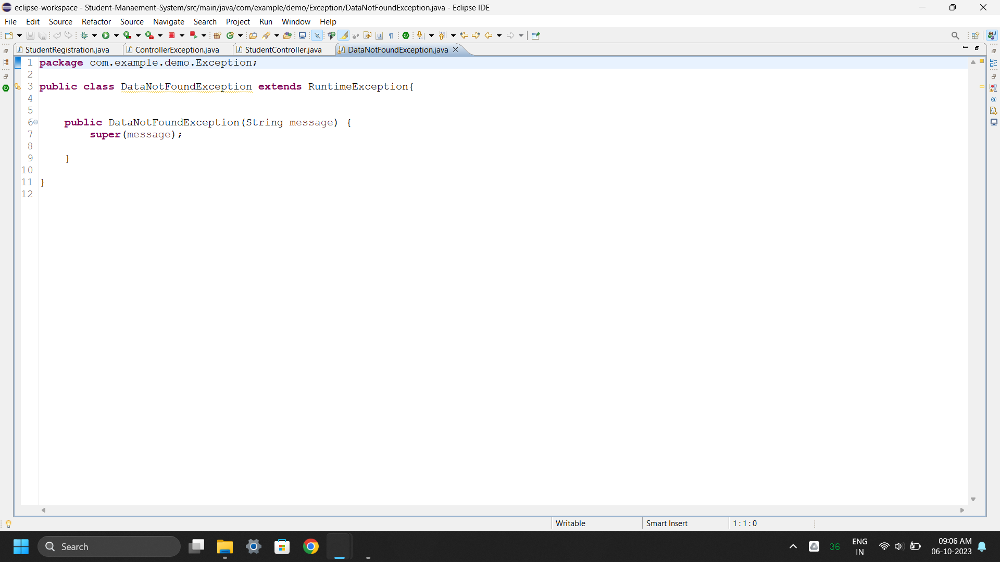

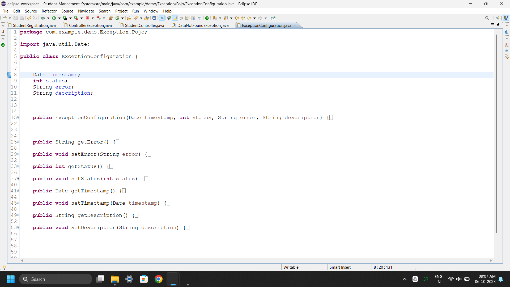

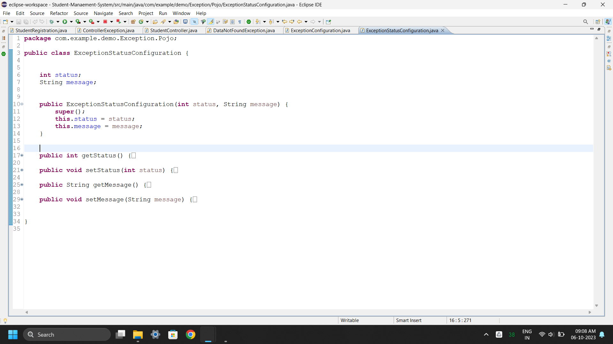

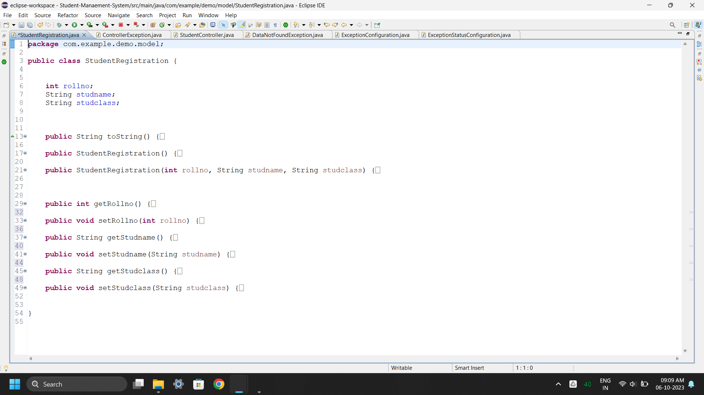

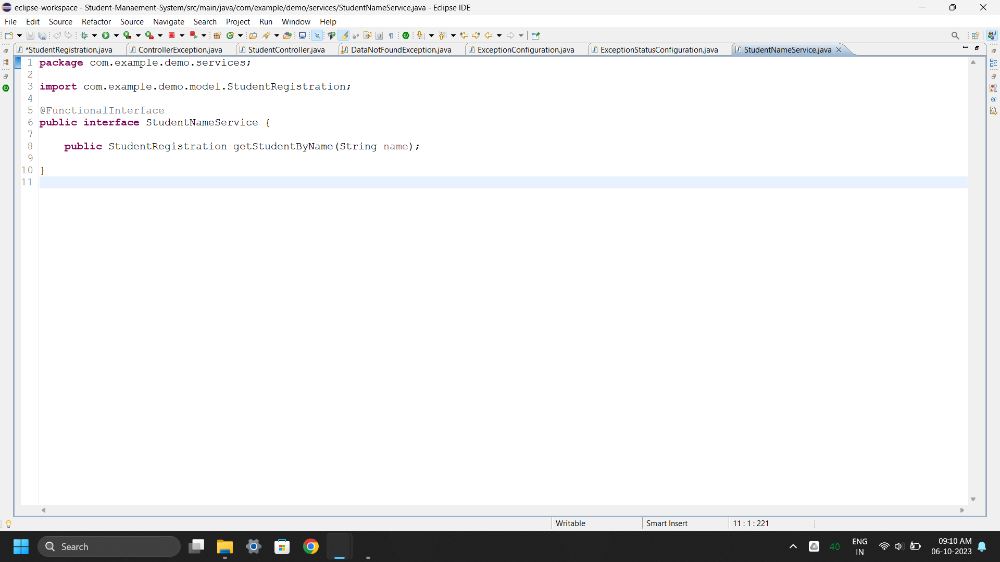

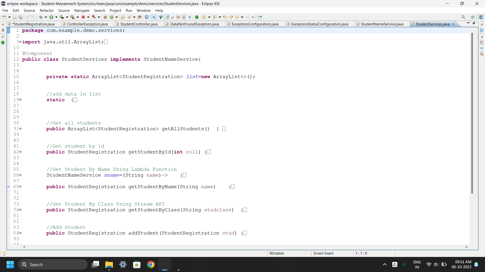

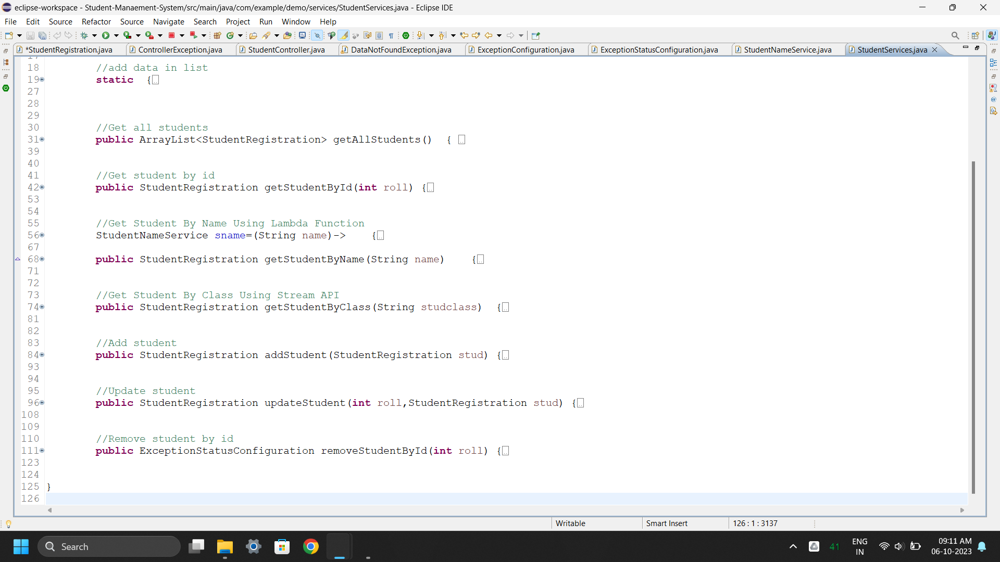

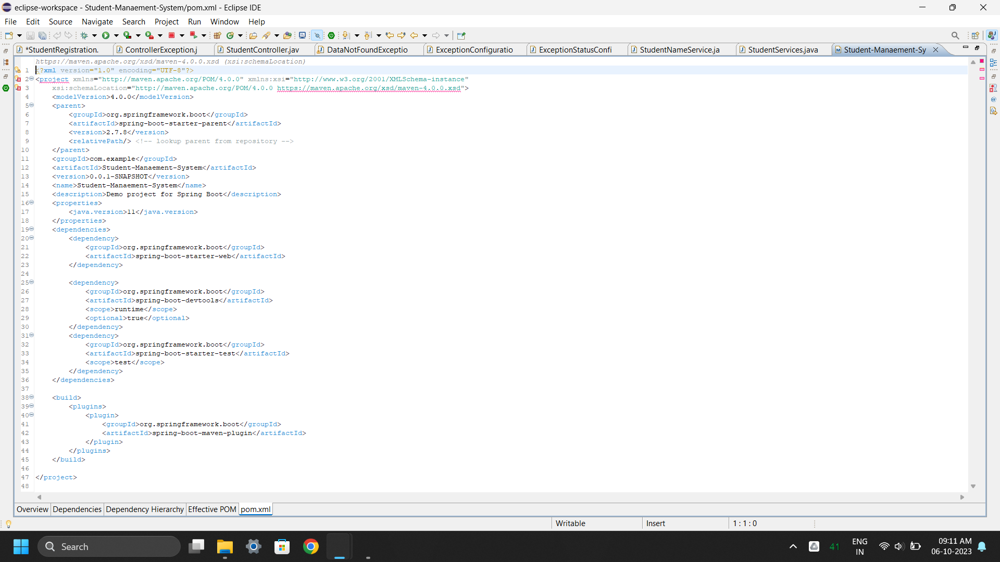


</p>


## Dependencies
- `Eclipse-IDE For Java Developer`
- `java-11`
- `Spring Boot Version 2.7.8`
- `Postman`
- `Windows OS`

